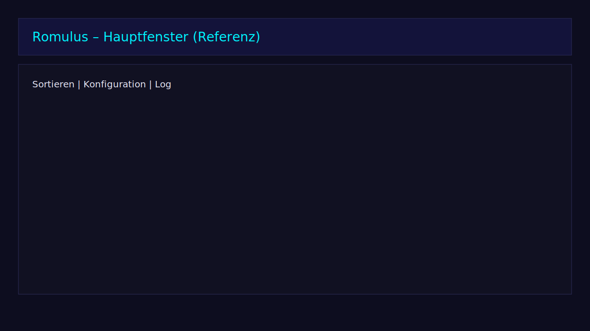

# User-Handbuch

**Stand:** 2026-03-10

---

## 1. Schnellstart

### Erster Start (ISS-001 Wizard)

Beim allerersten Start von `simple_sort.ps1` öffnet sich automatisch der **First-Start Wizard**:

1. **Intent-Auswahl** — Was möchtest du tun? (Aufräumen, Sortieren, Konvertieren, Alles)
2. **Grundeinstellungen** — Region-Priorität (z.B. EU > US > JP), DAT-Ordner, Tool-Pfade
3. **Preflight-Check** — Ampel zeigt ob Ordner lesbar, Tools verfügbar, DATs gefunden

Nach dem Wizard bist du direkt im Hauptfenster.

### Danach

1. `simple_sort.ps1` starten (Rechtsklick → "Mit PowerShell ausführen" oder: `powershell -ExecutionPolicy Bypass -File .\simple_sort.ps1`)
2. Im Tab **Sortieren** ROM-Ordner hinzufügen (Drag & Drop, Button oder `Ctrl+V`)
3. Optional `_TRASH`-Pfad setzen
4. Modus wählen und **Sortierung starten**

## 2. Screenshots



## 3. GUI-Übersicht

Die WPF-GUI ist in Tabs organisiert:

| Tab | Inhalt |
|-----|--------|
| **Sortieren** | Root-Verwaltung, Modus-Wahl (DryRun/Move), Start/Cancel, Progress-Anzeige mit ETA |
| **Konfiguration** | Einstellungen, Profile, Theme-Toggle, DAT-Mapping, **Features-Tab** |
| **Konvertierung** | Format-Konvertierung (CHD, RVZ, CSO, NKit, ECM), Queue mit Pause/Resume |
| **Log & Dashboard** | Live-Log, Statistiken, Duplikat-Heatmap, Diagramme |
| **Reports** | HTML/CSV/PDF-Reports, Export, Dashboards |

### Features-Tab (unter Konfiguration)

Der Features-Tab bietet Zugriff auf **65 Feature-Buttons**, organisiert in 9 kategorisierte Expander-Sektionen:

- **Analyse & Berichte** — Speicherplatz-Prognose, Junk-Report, ROM-Filter, Duplikat-Heatmap, Missing-ROM-Tracker, Cross-Root-Duplikate, Header-Analyse, Completeness, DryRun-Vergleich, Trendanalyse, Emulator-Kompatibilität
- **Konvertierung & Hashing** — CSO→CHD-Pipeline, NKit→ISO, Konvertierungs-Queue, Batch-Verify, Format-Priorität, Parallel-Hashing, GPU-Hashing
- **DAT & Verifizierung** — DAT-Auto-Update, DAT-Diff-Viewer, TOSEC-Support, Custom-DAT-Editor, Hash-DB-Export
- **Sammlungsverwaltung** — Smart-Collections, Clone-List, Cover-Scraping, Genre-Klassifikation, Spielzeit-Tracking, Sammlungs-Sharing, Virtuelle Ordner
- **Sicherheit & Integrität** — Integritäts-Monitor, Backup-Manager, Quarantäne, Rule-Engine, Patch-Engine, Header-Reparatur
- **Workflow & Automatisierung** — Command-Palette, Split-Panel, Filter-Builder, Ordner-Vorlagen, Pipeline-Engine, System-Tray, Scheduler, Rule-Pack-Sharing, Arcade Merge/Split
- **Export & Integration** — PDF-Report, Launcher-Integration, Tool-Import
- **Infrastruktur & Deployment** — Storage-Tiering, NAS, FTP/SFTP, Cloud-Sync, Docker, Mobile-Web-UI, Context-Menu, PSGallery, Paketmanager, Hardlinks, USN-Journal, Multi-Instance, Telemetrie
- **UI & Erscheinungsbild** — Barrierefreiheit, Theme-Engine

### Keyboard-Shortcuts

| Shortcut | Aktion |
|----------|--------|
| `Ctrl+R` | Run starten |
| `Ctrl+Z` | Undo |
| `F5` | Refresh |
| `Ctrl+Shift+D` | DryRun starten |
| `Escape` | Laufenden Run abbrechen |
| `Ctrl+Shift+P` | Command-Palette öffnen |

### Modi

| Modus | Beschreibung |
|-------|-------------|
| **Einfach** (`rbModeEinfach`) | 4 Entscheidungen — für Einsteiger |
| **Experte** (`rbModeExperte`) | Volle Kontrolle über alle Parameter |

## 4. Wichtige Modi
- **DryRun**: Nur Vorschau/Analyse, keine Datei-Verschiebung. Standard beim ersten Lauf.
- **Move**: Führt Verschiebungen aus (nur mit expliziter Bestätigung im Summary-Dialog).

**Empfohlener Flow:** DryRun → Summary prüfen → Bestätigen → Move

## 5. Konfiguration

### Externe Tools
- `chdman` — CHD-Konvertierung (MAME)
- `DolphinTool` — RVZ-Konvertierung (Dolphin Emulator)
- `7z` — Archiv-Handling
- `psxtract` — PBP → ISO
- `ciso` — CSO → ISO
- `ecm2bin` — ECM → BIN
- `NKit` — NKit → ISO

Tool-Pfade werden unter **Konfiguration → Werkzeuge** konfiguriert. Tool-Binaries werden gegen SHA256-Hashes aus `data/tool-hashes.json` verifiziert.

### DAT-Verifikation
- Hash-Typ: `SHA1`, `MD5` oder `CRC32`
- DAT-Root-Ordner konfigurierbar
- Unterstützte Quellen: No-Intro, Redump, FBNEO, TOSEC
- Auto-Update: Automatischer Check + Download neuer DAT-Versionen

### Profile
- Profile speichern / laden / importieren / exportieren
- Portable-Modus: `--Portable` Flag → Settings/Logs/Caches relativ zum Programmordner
- Cloud-Sync: Settings-Synchronisierung via OneDrive/Dropbox (nur Metadaten, keine ROMs)

### Settings-Pfad
- Standard: `%APPDATA%\RomCleanupRegionDedupe\settings.json`
- Portable: `./settings.json` (relativ zum Programmordner)

## 6. Sicherheit
- **Kein direktes Löschen** — Standard = Verschieben in Trash + Audit-Log
- **Path-Traversal-Schutz** — Moves nur innerhalb definierter Roots
- **Reparse-Point-Blocking** — Symlinks/Junctions werden explizit blockiert
- **Zip-Slip-Schutz** — Archiv-Pfade vor Extraktion validiert
- **CSV-Injection-Schutz** — Keine führenden `=`, `+`, `-`, `@` in Reports
- **Tool-Hash-Verifizierung** — SHA256 vor jedem Tool-Aufruf
- **XXE-Schutz** — Beim DAT-XML-Parsing aktiv
- **API-Sicherheit** — API-Key, Rate-Limiting (120/min), CORS, nur 127.0.0.1

## 7. Rollback
1. Über **Rückgängig**-Button (Puls-Animation) oder `Ctrl+Z`
2. Rollback-Wizard: Audit-CSV auswählen → Vorschau (was wird zurückverschoben) → `ROLLBACK` bestätigen
3. Jede Operation erzeugt ein signiertes Audit-CSV mit allen Moves

## 8. Format-Bewertung (Winner-Selection)

Bei der Deduplizierung wird das beste Format eines Spiels bevorzugt. Die Auswahl ist **deterministisch** — gleiche Inputs ergeben immer den gleichen Winner.

| Format | Score | Bemerkung |
|--------|-------|-----------|
| CHD | 850 | Komprimiert, verifizierbar, disc-basiert |
| ISO | 700 | Unkomprimiert, universell |
| RVZ | 700 | GameCube/Wii-optimiert (DolphinTool) |
| CSO | 600 | PSP-komprimiert |
| ZIP | 500 | Standard-Archiv |
| 7Z | 480 | Hohe Kompression |
| RAR | 400 | Proprietär |

**Winner-Selection Reihenfolge:**
1. Kategorie-Filter (GAME vs. JUNK vs. BIOS)
2. Regions-Score (bevorzugte Region aus `preferredRegions` = 1000−N)
3. Format-Score (siehe Tabelle)
4. Versions-Score (Verified `[!]` = +500; Revision a-z = 10×Ordinalwert)
5. Größen-Tiebreak (Disc → größer; Cartridge → kleiner)

### Format-Prioritätsliste

Pro Konsole kann eine eigene Format-Hierarchie definiert werden, z.B.:
- PS1: CHD > BIN/CUE > PBP > CSO
- GC/Wii: RVZ > ISO > NKit
- NES/SNES: ZIP > 7Z > ungepackt

## 9. Erkennungs-Pipeline

Die Konsolen-Erkennung durchläuft folgende Stufen (höhere Konfidenz wird bevorzugt):

| Stufe | Methode | Konfidenz |
|-------|---------|-----------|
| 1 | DAT Hash Match (SHA1/MD5/CRC32) | 100% |
| 1b | ZIP-Inhaltsanalyse (PS1/PS2-typische Dateien) | 75% |
| 2 | Archiv-Inhalt (eindeutige Extensions im ZIP) | 70% |
| 3 | Archiv-Disc-Header (ISO in ZIP) | 95% |
| 4 | DolphinTool Disc-ID (GC/Wii) | 90% |
| 4b | Disc-ID im Dateinamen `[RZDE01]` | 85% |
| 5a | Ordner-Name-Erkennung | 50% |
| 5b | Disc-Header direkt (ISO/BIN) | 95% |
| 5c | Eindeutige Extension (.gba, .nes, .nds) | 60% |
| 5d | Dateiname-Regex | 30% |
| 5e | Mehrdeutige Extension (.cso = PSP) | 40% |
| 6 | UNKNOWN + Reason-Code | 0% |

Weitere Details: siehe `docs/UNKNOWN_FAQ.md`

## 10. Konvertierungs-Pipeline

| Konsole | Zielformat | Tool |
|---------|-----------|------|
| PS1, Saturn, Dreamcast | CHD | `chdman createcd` |
| PS2 | CHD | `chdman createdvd` |
| GameCube, Wii | RVZ | `dolphintool` |
| PSP (PBP) | CHD | `psxtract` → `chdman` |
| PSP (CSO/ZSO) | CHD | `ciso` → `chdman` |
| NKit (GC/Wii) | ISO → RVZ | `NKit` → `dolphintool` |
| ECM | BIN | `ecm2bin` |
| NES, SNES etc. | ZIP | `7z` |

- **Konvertierungs-Queue**: Lange Konvertierungen können pausiert und fortgesetzt werden. Status wird in `reports/convert-queue.json` persistiert.
- **Batch-Verify**: Automatischer CRC/SHA1-Vergleich vor und nach Konvertierung.

## 11. Reporting

| Format | Beschreibung |
|--------|-------------|
| **HTML-Report** | Interaktiver Report mit Diagrammen, CSP-Header, Keep/Move/Junk pro Konsole |
| **CSV-Audit** | SHA256-signiert, alle Moves/Actions dokumentiert |
| **JSON-Summary** | Maschinenlesbares Ergebnis mit Status, ExitCode, Preflight |
| **PDF-Report** | Professioneller Sammlungs-Report mit Statistiken und Diagrammen |
| **JSONL-Logs** | Strukturierte Logs mit Correlation-ID und Phase-Metriken |

## 12. CLI-Nutzung

```powershell
# DryRun mit JSON-Ausgabe
pwsh -NoProfile -File .\Invoke-RomCleanup.ps1 -Roots 'D:\ROMs' -Mode DryRun -EmitJsonSummary

# Move mit Region-Bevorzugung
pwsh -NoProfile -File .\Invoke-RomCleanup.ps1 -Roots 'D:\ROMs' -Mode Move -PreferRegions EU,US
```

Exit-Codes: `0` = Erfolg, `1` = Fehler, `2` = Abgebrochen, `3` = Preflight fehlgeschlagen.

## 13. REST API

```powershell
$env:ROM_CLEANUP_API_KEY = 'mein-key'
pwsh -NoProfile -File .\Invoke-RomCleanupApi.ps1 -Port 7878 -CorsMode strict-local
```

| Methode | Pfad | Zweck |
|---------|------|-------|
| `GET` | `/health` | Health-Check |
| `POST` | `/runs` | Run erstellen |
| `GET` | `/runs/{id}` | Run-Status |
| `GET` | `/runs/{id}/result` | Ergebnis |
| `POST` | `/runs/{id}/cancel` | Abbrechen |
| `GET` | `/runs/{id}/stream` | SSE-Fortschritt |

## 14. Troubleshooting

| Problem | Lösung |
|---------|--------|
| Fehlende Tools | Auto-Entdecken im Konfig-Tab oder Pfad manuell setzen |
| DAT-Fehler | `DAT-Root` und Hash-Typ prüfen; DAT-Auto-Update nutzen |
| UNBEKANNT-Dateien | Siehe `docs/UNKNOWN_FAQ.md` — DATs konfigurieren oder Dateien in benannte Ordner verschieben |
| API-Fehler 401 | `X-Api-Key` Header setzen |
| UI friert ein | Große Sammlungen: Parallel-Hashing aktivieren, MemoryGuard prüfen |
| Rollback fehlgeschlagen | Audit-CSV manuell prüfen, Quell-/Zielpfade noch vorhanden? |
